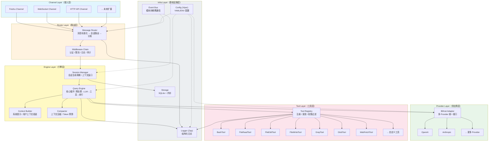

# Go Rebuild — 系统架构设计

> 版本: v1.0.0 | 日期: 2026-04-05 | 作者: 架构组

## 1. 设计原则

| 原则 | 说明 |
|------|------|
| 高内聚低耦合 | 每个 package 只做一件事，通过 interface 交互 |
| 面向接口编程 | 所有核心模块先定义 interface，再写实现 |
| 分层架构 | Channel → Router → Engine → Provider/Tool，单向依赖 |
| 插件化扩展 | Channel、Tool、Provider、Middleware 均为可插拔组件 |
| 配置驱动 | LLM 参数、日志级别、工具权限等统一通过配置文件管理 |
| 简洁优先 | 不做微服务拆分，单体内通过 interface 保留拆分能力 |

## 2. 系统分层架构



## 3. 目录结构

```
go_rebuild/
├── cmd/
│   └── server/
│       └── main.go              # 启动入口
├── internal/
│   ├── channel/                  # 接入层
│   │   ├── channel.go            # Channel interface
│   │   ├── feishu/               # 飞书实现
│   │   ├── websocket/            # WebSocket 实现
│   │   └── http/                 # HTTP API 实现
│   ├── router/                   # 路由层
│   │   ├── router.go             # Router interface + 实现
│   │   └── middleware/           # 中间件链
│   │       ├── middleware.go     # Middleware interface
│   │       ├── auth.go           # 认证
│   │       ├── ratelimit.go      # 限流
│   │       └── logging.go        # 请求日志
│   ├── engine/                   # 引擎层
│   │   ├── engine.go             # QueryEngine interface + 实现
│   │   ├── session/              # 会话管理
│   │   │   ├── session.go        # Session interface
│   │   │   ├── manager.go        # SessionManager
│   │   │   └── message.go        # 消息类型定义
│   │   ├── context/              # 上下文组装
│   │   │   └── builder.go        # ContextBuilder
│   │   └── compact/              # 上下文压缩
│   │       └── compactor.go      # Compactor interface + 实现
│   ├── provider/                 # LLM 供应商层
│   │   ├── provider.go           # Provider interface
│   │   ├── bifrost/              # Bifrost 适配器
│   │   │   └── adapter.go
│   │   ├── openai/               # 直连 OpenAI（备用）
│   │   └── anthropic/            # 直连 Anthropic（备用）
│   ├── tool/                     # 工具层
│   │   ├── tool.go               # Tool interface
│   │   ├── registry.go           # ToolRegistry
│   │   ├── permission.go         # 权限检查
│   │   ├── bash/                 # Shell 执行
│   │   ├── fileread/             # 文件读取
│   │   ├── fileedit/             # 文件编辑
│   │   ├── filewrite/            # 文件写入
│   │   ├── grep/                 # 内容搜索
│   │   ├── glob/                 # 文件搜索
│   │   └── webfetch/             # URL 抓取
│   ├── storage/                  # 存储层
│   │   ├── storage.go            # Storage interface
│   │   ├── memory/               # 内存实现
│   │   └── sqlite/               # SQLite 实现
│   ├── event/                    # 事件总线
│   │   └── bus.go                # EventBus interface + 实现
│   └── config/                   # 配置管理
│       └── config.go             # 配置结构 + 加载
├── pkg/                          # 公共库（可被外部引用）
│   ├── types/                    # 公共类型
│   │   ├── message.go            # Message, Role, ContentBlock
│   │   ├── tool.go               # ToolCall, ToolResult
│   │   └── event.go              # Event types
│   └── errors/                   # 统一错误定义
│       └── errors.go
├── configs/
│   ├── config.yaml               # 默认配置
│   └── config.example.yaml       # 配置示例
├── go.mod
├── go.sum
└── Makefile
```

## 4. 核心 Interface 设计

### 4.1 Channel — 接入层接口

```go
// Channel 定义了一个消息接入通道
type Channel interface {
    // Name 返回通道标识符
    Name() string
    // Start 启动通道，接收消息通过 handler 回调
    Start(ctx context.Context, handler MessageHandler) error
    // Stop 优雅关闭
    Stop(ctx context.Context) error
    // Send 向指定会话发送消息
    Send(ctx context.Context, sessionID string, msg *Message) error
}

// MessageHandler 是 Channel 收到消息后的回调
type MessageHandler func(ctx context.Context, incoming *IncomingMessage) error
```

### 4.2 Provider — LLM 供应商接口

```go
// Provider 定义 LLM 调用接口
type Provider interface {
    // Chat 发送消息并获取流式响应
    Chat(ctx context.Context, req *ChatRequest) (*ChatStream, error)
    // CountTokens 估算 token 数
    CountTokens(ctx context.Context, messages []Message) (int, error)
    // Name 返回 provider 标识
    Name() string
}

// ChatStream 封装流式响应
type ChatStream struct {
    Events <-chan StreamEvent  // 流式事件 channel
    Err    func() error       // 最终错误（流结束后调用）
}

// StreamEvent 流式事件（文本块、工具调用、完成等）
type StreamEvent struct {
    Type      EventType
    Text      string           // type=text
    ToolCall  *ToolCall        // type=tool_use
    Usage     *Usage           // type=message_end
    StopReason string
}
```

### 4.3 Tool — 工具接口

```go
// Tool 定义一个可被 LLM 调用的工具
type Tool interface {
    // Name 工具唯一标识
    Name() string
    // Description 给 LLM 看的描述
    Description() string
    // InputSchema JSON Schema 定义
    InputSchema() map[string]interface{}
    // Execute 执行工具
    Execute(ctx context.Context, input json.RawMessage) (*ToolResult, error)
    // IsReadOnly 是否只读（用于并发控制）
    IsReadOnly() bool
}

// ToolResult 工具执行结果
type ToolResult struct {
    Content  string            // 文本结果
    IsError  bool              // 是否为错误
    Metadata map[string]any    // 附加元数据
}
```

### 4.4 Engine — 查询引擎接口

```go
// Engine 定义核心查询引擎
type Engine interface {
    // ProcessMessage 处理一条用户消息，返回流式响应
    ProcessMessage(ctx context.Context, sessionID string, msg *Message) (<-chan EngineEvent, error)
    // AbortSession 中止指定会话
    AbortSession(ctx context.Context, sessionID string) error
}

// EngineEvent 引擎输出事件
type EngineEvent struct {
    Type       EngineEventType  // text, tool_start, tool_end, error, done
    Text       string
    ToolName   string
    ToolInput  string
    ToolResult *ToolResult
    Error      error
    Usage      *Usage
}
```

### 4.5 Middleware — 中间件接口

```go
// Middleware 定义请求处理中间件
type Middleware func(next MessageHandler) MessageHandler
```

### 4.6 Storage — 存储接口

```go
// Storage 定义会话持久化接口
type Storage interface {
    // SaveSession 保存会话
    SaveSession(ctx context.Context, session *Session) error
    // LoadSession 加载会话
    LoadSession(ctx context.Context, id string) (*Session, error)
    // ListSessions 列出会话
    ListSessions(ctx context.Context, filter *SessionFilter) ([]*SessionSummary, error)
    // DeleteSession 删除会话
    DeleteSession(ctx context.Context, id string) error
}
```

## 5. 模块职责矩阵

| 模块 | 职责 | 依赖 | 被依赖 |
|------|------|------|--------|
| `channel/*` | 接收外部消息，发送响应 | `pkg/types`, `config` | `router` |
| `router` | 消息标准化，会话路由，中间件链 | `channel`, `engine`, `config` | `cmd/server` |
| `engine` | 核心查询循环（预处理→LLM→工具→续行） | `provider`, `tool`, `session`, `context`, `compact` | `router` |
| `session` | 会话生命周期，消息历史，token 跟踪 | `storage`, `pkg/types` | `engine` |
| `context` | 系统提示组装，用户上下文 | `config`, `session` | `engine` |
| `compact` | Token 预算管理，上下文压缩 | `provider`(摘要用) | `engine` |
| `provider/*` | LLM API 调用，流式响应 | `config`, `pkg/types` | `engine`, `compact` |
| `tool/*` | 工具执行（Shell, 文件, 搜索等） | `config`, `pkg/types` | `engine` |
| `storage/*` | 会话持久化 | `pkg/types` | `session` |
| `config` | 配置加载与管理 | Viper | 全局 |
| `event` | 模块间异步通信 | 无 | `session`, `router` |
| `pkg/types` | 公共数据类型 | 无 | 全局 |
| `pkg/errors` | 统一错误码 | 无 | 全局 |

## 6. 配置结构设计

```yaml
# configs/config.yaml
server:
  host: "0.0.0.0"
  port: 8080

log:
  level: "info"          # debug, info, warn, error
  format: "json"         # json, console
  output: "stdout"       # stdout, file
  file_path: "./logs/app.log"

llm:
  default_provider: "anthropic"
  providers:
    anthropic:
      api_key: "${ANTHROPIC_API_KEY}"
      model: "claude-sonnet-4-20250514"
      max_tokens: 8192
      temperature: 0.7
    openai:
      api_key: "${OPENAI_API_KEY}"
      model: "gpt-4o"
      max_tokens: 4096
      temperature: 0.7
  # Bifrost 统一配置（可选）
  bifrost:
    enabled: false
    api_key: "${BIFROST_API_KEY}"

engine:
  max_turns: 50               # 单次对话最大轮次
  auto_compact_threshold: 0.8  # 上下文使用 80% 时触发压缩
  tool_timeout: "120s"         # 工具执行超时

session:
  max_messages: 200            # 单会话最大消息数
  idle_timeout: "30m"          # 空闲超时
  storage: "sqlite"            # memory, sqlite

channels:
  feishu:
    enabled: false
    app_id: "${FEISHU_APP_ID}"
    app_secret: "${FEISHU_APP_SECRET}"
  websocket:
    enabled: true
    path: "/ws"
  http:
    enabled: true
    path: "/api/v1"

tools:
  bash:
    enabled: true
    timeout: "60s"
    sandbox: false             # 进程级隔离
  file_read:
    enabled: true
    max_file_size: "10MB"
  file_edit:
    enabled: true
  file_write:
    enabled: true
  grep:
    enabled: true
  glob:
    enabled: true
  web_fetch:
    enabled: true
    timeout: "30s"
```

## 7. 关键设计决策

### 7.1 多 Channel 接入

- 每个 Channel 实现 `Channel` interface，独立 goroutine 运行
- Channel 收到消息后调用 `MessageHandler` 回调，交给 Router 处理
- Router 将不同 Channel 的消息标准化为统一的 `IncomingMessage`
- 新增 Channel 只需实现接口 + 注册，零修改核心代码

### 7.2 LLM 多 Provider

- 默认通过 Bifrost SDK 实现多 provider 统一调用
- 同时保留直连 adapter 作为降级方案
- Provider 选择通过配置文件 `llm.default_provider` 控制
- 支持运行时切换（通过会话级配置覆盖）

### 7.3 工具执行

- 工具通过 `Tool` interface 注册到 `ToolRegistry`
- 只读工具可并发执行（`IsReadOnly() == true`）
- 写入工具串行执行，带超时控制
- BashTool 通过 `os/exec` + `context.WithTimeout` 实现进程级隔离
- 工具权限通过 `PermissionChecker` 中间件控制

### 7.4 中间件机制

- `Middleware` 是 `func(next MessageHandler) MessageHandler` 函数签名
- 支持链式组合：`auth → ratelimit → logging → handler`
- 新增中间件只需写一个函数，在启动时注册

### 7.5 会话管理

- 内存中维护活跃会话（带 LRU 淘汰）
- SQLite 持久化历史会话
- 支持会话恢复：从 SQLite 加载历史到内存
- 空闲超时自动归档

## 8. Revision History

| 日期 | 版本 | 变更 |
|------|------|------|
| 2026-04-05 | v1.0.0 | 初始架构设计 |
