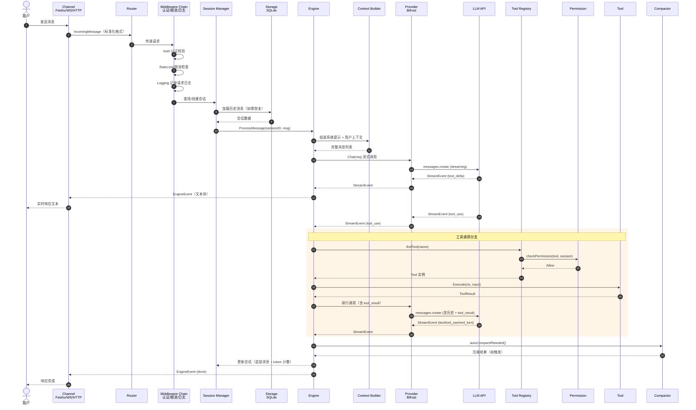
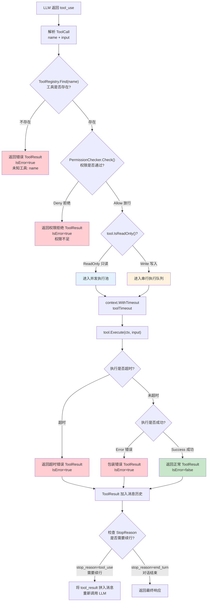
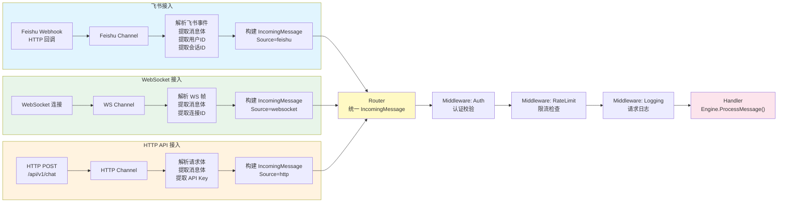
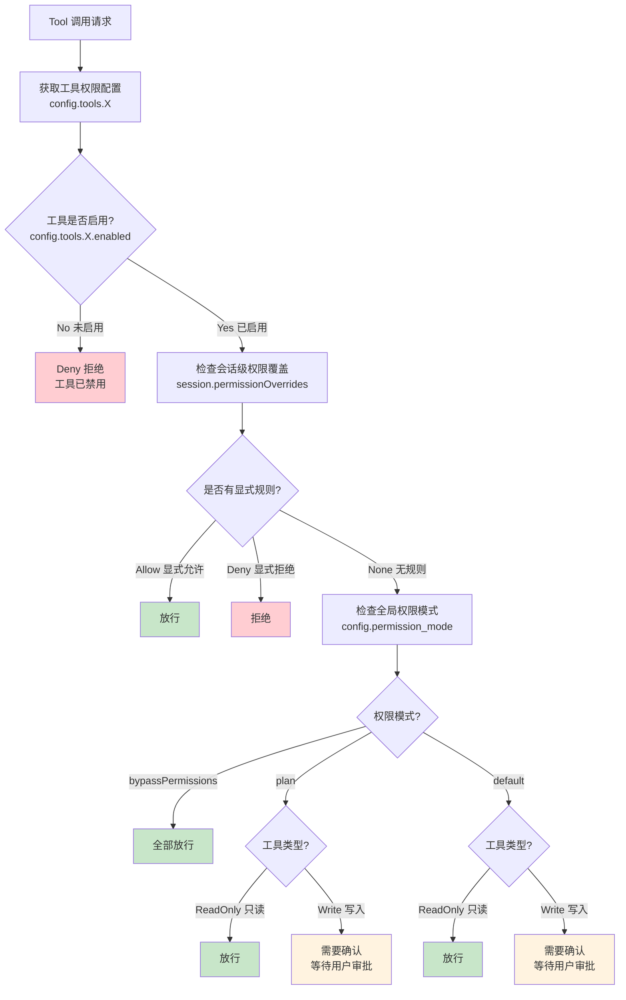
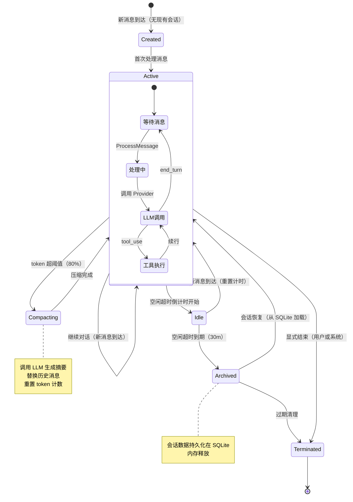
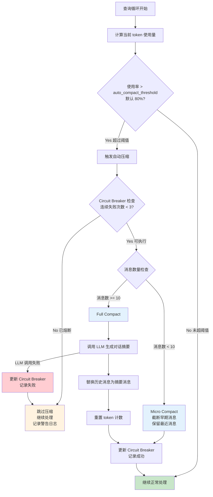
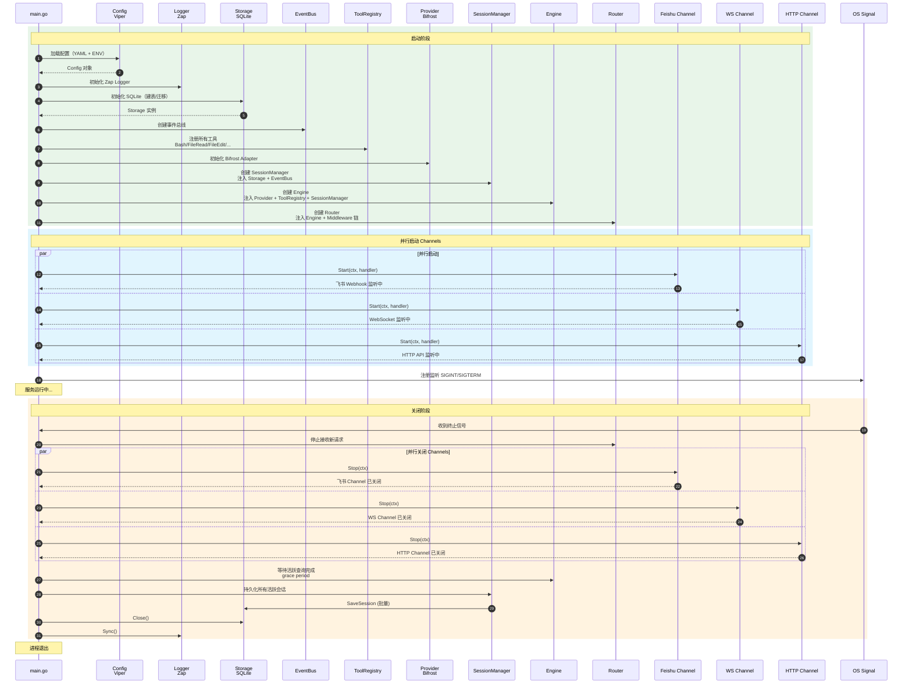
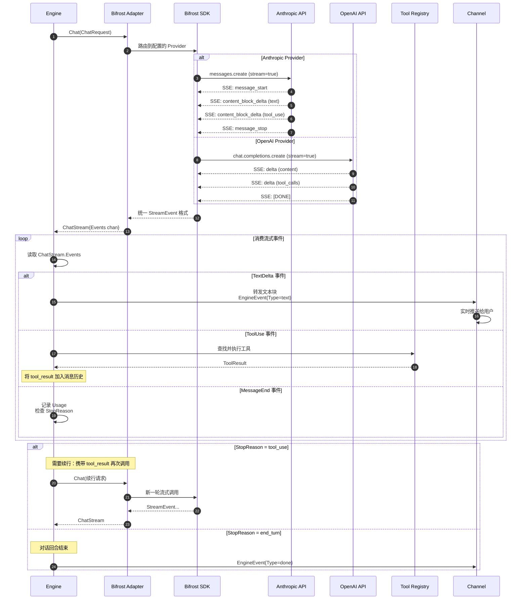

# Go Rebuild — UML 流程图文档

> 版本: v1.0.0 | 日期: 2026-04-05 | 作者: 架构组

本文档使用 Mermaid 语法描述系统各核心流程的 UML 图，作为 [ARCHITECTURE.md](docs/refactor/ARCHITECTURE.md) 的补充。所有流程图均基于架构文档中定义的分层结构（Channel → Router → Engine → Provider/Tool）和核心 Interface 设计。

---

## 1. 消息处理主流程

本流程图展示一条用户消息从接入到响应的完整生命周期。核心设计思路是：Channel 层负责协议适配，Router 层负责标准化与中间件链处理，Engine 层承担查询循环（LLM 调用 → 工具执行 → 续行判断），最终流式事件通过 Channel 返回给用户。关键决策点在于 `StopReason` 的判断——当 LLM 返回 `tool_use` 时，Engine 进入工具执行分支并自动续行，直到 LLM 返回 `end_turn` 或达到最大轮次限制。

---

## 2. 工具调用详细流程

本流程图展示工具执行的完整决策树。关键设计决策包括：只读工具（如 `GrepTool`、`GlobTool`、`FileReadTool`）可进入并发执行池以提高吞吐量，而写入工具（如 `BashTool`、`FileEditTool`、`FileWriteTool`）必须串行执行以避免竞态条件。所有工具执行均受 `context.WithTimeout` 保护，超时时间由 `engine.tool_timeout` 配置项控制（默认 120 秒）。

---

## 3. 多 Channel 路由流程

本流程图展示多 Channel 消息如何统一汇聚到 Router 层。架构的核心设计是：每个 Channel 独立运行在自己的 goroutine 中，负责协议解析和消息提取，然后构建标准化的 `IncomingMessage`（包含消息体、来源标识、会话标识）。Router 接收所有 Channel 的标准化消息后，依次经过中间件链处理，最终交给 Engine。新增 Channel 只需实现 `Channel` interface 并在启动时注册，无需修改核心代码。

---

## 4. 权限检查流程

本流程图展示工具权限检查的完整决策逻辑。权限系统采用三级判定：首先检查工具级开关（`config.tools.X.enabled`），然后检查会话级权限覆盖（允许单个会话临时放行或禁止特定工具），最后回落到全局权限模式判断。全局模式支持 `bypassPermissions`（全部放行）、`plan`（只读放行，写入需确认）、`default`（根据工具类型判断）三种策略。这种分层设计既保证了安全性，又提供了灵活的覆盖能力。

---

## 5. 会话生命周期

本状态图展示会话从创建到销毁的完整生命周期。核心设计包括：活跃会话保存在内存中（带 LRU 淘汰机制），空闲超时后自动归档到 SQLite，归档会话可按需恢复。压缩状态（`Compacting`）是活跃状态的子过程——当 token 使用量超过阈值（默认 80%）时，Engine 触发自动压缩以释放上下文窗口空间。空闲超时默认为 30 分钟（由 `session.idle_timeout` 配置项控制）。

---

## 6. 上下文压缩流程

本流程图展示上下文压缩的完整策略。压缩机制采用 circuit breaker 模式防止连续失败导致资源浪费——当连续压缩失败达到 3 次时，自动熔断并跳过后续压缩请求，直到成功重置。压缩策略分为两种：当消息数较少（< 10 条）时使用 micro compact（简单截断早期消息），当消息数较多时使用 full compact（调用 LLM 生成摘要替换历史）。阈值由 `engine.auto_compact_threshold` 配置项控制（默认 80%）。

---

## 7. 启动与关闭流程

本流程图展示系统的优雅启动和关闭过程。启动阶段采用顺序初始化基础设施（Config → Logger → Storage → EventBus），然后注册工具和创建核心组件，最后并行启动所有 Channel。关闭阶段遵循相反顺序：先停止接收新请求，然后并行关闭所有 Channel，等待活跃查询在 grace period 内完成，持久化所有活跃会话，最后关闭存储和日志。这种设计确保了数据不丢失和连接不泄漏。

---

## 8. LLM Provider 调用流程

本流程图展示通过 Bifrost Adapter 进行多 Provider LLM 调用的详细过程。Bifrost 作为统一抽象层，将不同 Provider 的 API 差异（请求格式、SSE 事件结构、错误码）屏蔽在适配器内部，向 Engine 暴露统一的 `ChatStream` 接口。Engine 通过 channel 消费流式事件，根据事件类型分别处理文本增量、工具调用和消息结束。当直连模式启用时（Bifrost 不可用或配置为 fallback），Engine 直接调用对应 Provider 的 Adapter。

---

## Revision History

| 日期 | 版本 | 变更 |
|------|------|------|
| 2026-04-05 | v1.0.0 | 初始 UML 流程图文档，包含 8 个核心流程图 |
