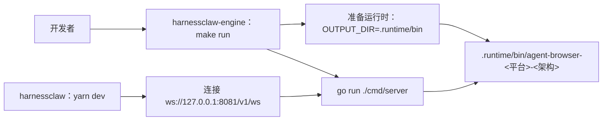
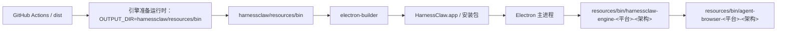

# 原生二进制运行时设计说明

> 适用范围：HarnessClaw 引入 `agent-browser` 或其他平台相关原生二进制文件时，源码归属、运行时准备、本地启动、Electron 打包发布和后续扩展的统一规则。

## 1. 背景

Browser Agent 引入了一个新的运行时依赖：`agent-browser`。

它不是 Go 包，也不是前端依赖，而是按操作系统和处理器架构分发的原生二进制文件，例如：

- `agent-browser-darwin-arm64`
- `agent-browser-darwin-x64`
- `agent-browser-win32-x64.exe`
- `agent-browser-linux-x64`

这个依赖暴露了一个更通用的问题：当 HarnessClaw 未来继续引入其他原生二进制文件时，应由谁拥有运行时定义，由谁准备产物，本地开发和 Electron 打包发布如何保持一致。

## 2. 这次踩到的问题

### 2.1 能力归属和分发归属混在一起

Browser Agent 的推理、工具调用、`agent-browser` 命令封装都在 Go 引擎中，但技能文件和原生二进制文件一度放在 Electron 项目的 `resources/` 下。

这会造成架构表达不清：

| 内容 | 实际职责归属 | 当前容易误解的归属 |
|---|---|---|
| Browser Agent 技能 | Go 引擎 | Electron 资源目录 |
| `agent-browser` 调用逻辑 | Go 引擎 | Electron 打包流程 |
| `agent-browser` 原生二进制文件 | 引擎运行时伴随文件 | 前端资源 |
| BrowserWindow / CDP 端点 | Electron | Electron |

Electron 应该是桌面分发容器，不应该成为 Browser Agent 操作语义的唯一来源。

### 2.2 本地启动和打包启动路径不同

当前存在两类启动方式：

1. VS Code 调试 / Electron 伴随进程流程
   - 先把引擎二进制文件和 `agent-browser` 复制到 `harnessclaw/resources/bin`
   - 再执行 `yarn dev`
   - Electron 主进程启动打包目录中的引擎

2. 团队常用分离流程
   - `cd harnessclaw-engine && make run`
   - `cd harnessclaw && yarn dev`
   - 后端先启动，前端连接已有引擎

问题是：`make run` 启动的是独立运行的引擎。如果 Browser Agent 的依赖只在前端 `resources/` 里，独立引擎就无法自然找到技能文件和原生二进制文件。

### 2.3 `os.Executable()` 路径推导只适合打包后的伴随进程

打包后的应用目录形态类似：

```text
HarnessClaw.app/Contents/Resources/bin/
  harnessclaw-engine-darwin-arm64
  agent-browser-darwin-arm64
```

此时引擎可以通过自身可执行文件目录找到 `agent-browser`：

```text
dirname(os.Executable()) / agent-browser-darwin-arm64
```

但 `go run` 场景中，Go 会把临时二进制文件放到系统临时目录。这个目录旁边没有 `agent-browser`，也没有 Electron 的资源目录。因此独立引擎不能只依赖 `os.Executable()` 推导运行时资源。

### 2.4 把原生二进制文件直接嵌进 Go 二进制文件并不干净

技术上可以用 `go:embed` 把原生二进制文件的字节塞进引擎二进制文件，但这不是推荐方案：

- 操作系统只能执行磁盘文件，不能直接执行嵌入字节。运行时仍要释放到临时目录、执行 `chmod +x`、再启动。
- `agent-browser` 是平台相关产物。嵌入后，每个平台的引擎都要携带对应的原生二进制文件，升级 `agent-browser` 也必须重新发布引擎。
- macOS / Windows 对可执行文件签名、公证、隔离标记、杀毒扫描敏感。运行时释放可执行文件，比随安装包作为伴随文件分发更难治理。
- 排障不透明。伴随文件可以独立执行 `file`、`sha256`、替换验证；嵌入引擎后，问题通常只能通过重新发布引擎解决。

所以正确边界不是“把所有东西塞进一个 Go 二进制文件”，而是“引擎拥有运行时定义，原生二进制文件作为伴随文件被统一准备”。

## 3. 设计原则

### 3.1 职责原则

| 类型 | 归属 | 形态 |
|---|---|---|
| 操作语义、提示词、引用资料、模板 | 引擎 | 可用 `go:embed` 携带 |
| 原生二进制文件 | 引擎运行时 | 伴随文件 |
| 本地启动准备逻辑 | 引擎 | `make prepare-runtime` / `make run` |
| Electron 安装包分发 | 前端 | 复制引擎运行时包到应用资源目录 |

### 3.2 一套准备逻辑，两个输出目录

本地和打包可以有不同输出目录，但不能有两套准备逻辑。

统一入口应放在引擎侧，例如：

```bash
cd harnessclaw-engine
make prepare-runtime OUTPUT_DIR=<目标目录>
```

本地开发输出：

```text
harnessclaw-engine/.runtime/bin/
  agent-browser-darwin-arm64
```

Electron 打包输出：

```text
harnessclaw/resources/bin/
  harnessclaw-engine-darwin-arm64
  agent-browser-darwin-arm64
```

差异只在 `OUTPUT_DIR`，准备逻辑、版本锁定、平台命名、校验规则必须一致。

### 3.3 本地开发不依赖前端目录

团队本地推荐流程应是：

```bash
cd harnessclaw-engine
make run
```

`make run` 内部应保证：

1. 准备 `.runtime/bin/agent-browser-<平台>-<架构>`。
2. 启动引擎时显式传入该二进制文件路径。
3. 引擎能加载自己的 Browser Agent 技能、引用资料和模板。

前端本地启动只负责连接：

```bash
cd harnessclaw
yarn dev
```

如果引擎已经在运行，前端不应重复启动打包目录中的伴随引擎。

## 4. 最终架构

### 4.0 实施顺序和优先级

这套改造按“先建立权威产物，再迁移消费者”的顺序实施：

| 优先级 | 事项 | 原因 |
|---|---|---|
| P0 | 引擎侧建立 `prepare-runtime` / `runtime-bundle` 入口 | 先让运行时定义有唯一来源，否则 Electron 仍会维护一套下载规则 |
| P0 | 引擎发布流程产出 `harnessclaw-engine-runtime-<平台>-<架构>.zip` | Electron 打包需要直接消费一个完整运行时包，而不是分别下载多个二进制文件 |
| P1 | Electron `prepare:bin` / release workflow 改为解包运行时包 | 让 Action 和本地 sidecar 准备逻辑都从引擎运行时定义派生 |
| P1 | standalone `make run` 自动准备 `.runtime/bin` 并显式传 `agent-browser` 路径 | 团队本地流程不再依赖前端 `resources/bin` |
| P2 | 前端开发模式优先连接已有引擎 | 避免 `make run` 后 `yarn dev` 又重复启动打包目录中的伴随引擎 |
| P3 | Browser Agent 技能、引用资料、模板迁移到引擎并用 `go:embed` 携带 | 完成语义归属收敛，让前端只保留分发职责 |

当前阶段已完成 P0-P3：二进制运行时由引擎准备和发布，Browser Agent 操作语义由引擎内嵌，Electron 不再拥有 Browser Agent 技能来源。

### 4.1 本地分离启动



本地关键点：

- `make run` 是完整后端入口，不要求开发者手动去前端目录准备 Browser Agent 依赖。
- 技能、引用资料和模板由引擎自己携带，建议用 `go:embed`。
- `agent-browser` 是伴随文件，路径由 `make run` 显式传给引擎。

### 4.2 Electron 打包运行



打包关键点：

- Electron 发布流程仍负责打包桌面应用。
- 但 Browser Agent 运行时的准备规则来自引擎，不在前端里重写。
- 打包后的应用中，引擎和 `agent-browser` 放在同一个 `resources/bin` 目录，引擎可以使用打包后回退定位找到伴随文件。

### 4.3 引擎内部定位顺序

推荐定位顺序：

1. 显式配置路径：`tools.browser_agent.binary_path`
2. 环境变量映射：`CLAUDE_TOOLS_BROWSER_AGENT_BINARY_PATH`
3. 打包后回退定位：`dirname(os.Executable()) / agent-browser-<平台>-<架构>`

本地 `make run` 使用第 1 或第 2 种。

打包运行使用第 3 种。

## 5. 统一后的流程

### 5.1 本地开发

```bash
cd harnessclaw-engine
make run
```

等价于：

```bash
make prepare-runtime OUTPUT_DIR=.runtime/bin
CLAUDE_TOOLS_BROWSER_AGENT_BINARY_PATH=.runtime/bin/agent-browser-<平台>-<架构> \
  go run ./cmd/server -config ./configs/config.yaml
```

默认情况下 `prepare-runtime` 使用 `runtime/agent-browser/VERSION` 作为唯一版本锁：

1. 如果目标目录已有同平台、同版本 manifest，并且 `agent-browser --version` 与锁定版本一致，则直接复用本地 `agent-browser`。
2. 否则按锁定版本从上游 release asset 下载目标平台二进制。
3. 如果下载失败，优先从 engine 本地 `dist/harnessclaw-engine-runtime-<平台>-<架构>.zip` 恢复同版本二进制；恢复后同样执行版本校验。
4. 开发机离线验证或应急恢复时，可以显式指定已有原生二进制文件：

```bash
AGENT_BROWSER_NATIVE_BINARY=/path/to/agent-browser-darwin-arm64 make prepare-runtime
```

输出目录会写入 `harnessclaw-runtime-manifest.json`，用于后续本地启动快速判断是否可以复用已有二进制。`AGENT_BROWSER_NATIVE_BINARY` 只用于本地或应急验证；发布流程应使用 `GH_TOKEN` 下载锁定版本，避免发布产物来源不明。

下载连接和下载流都有空闲超时；如需在本地强制缩短慢速下载等待时间，可以设置 `HARNESSCLAW_DOWNLOAD_TOTAL_TIMEOUT_MS`，触发后会进入本地 runtime bundle 恢复路径。

前端：

```bash
cd harnessclaw
yarn dev
```

前端开发模式应检测已有引擎。如果 `127.0.0.1:8081` 已可连接，只连接，不重复启动伴随引擎。

### 5.2 Electron 打包

本地打包或 sidecar 调试：

```bash
cd harnessclaw
HARNESSCLAW_ENGINE_SOURCE_DIR=/absolute/path/to/harnessclaw-engine yarn prepare:bin
```

`yarn prepare:bin` 会调用 `HARNESSCLAW_ENGINE_SOURCE_DIR/scripts/prepare-runtime.cjs --include-engine --output-dir resources/bin`，不会在前端重新实现 `agent-browser` 下载规则。本地源码打包必须显式提供 `HARNESSCLAW_ENGINE_SOURCE_DIR` 或 `--engine-source-dir`，不再猜测 `../harnessclaw-engine`。

然后构建 Electron：

```bash
yarn build
electron-builder --config electron-builder.config.cjs ...
```

发布流程中，引擎 release 直接发布运行时包：

```text
harnessclaw-engine-runtime-darwin-arm64.zip
  bin/harnessclaw-engine-darwin-arm64
  bin/agent-browser-darwin-arm64
  manifest.json
```

Windows 运行时包使用 Electron 运行时平台名 `windows-x64` 命名，包内 `agent-browser` 仍使用上游资产名：

```text
harnessclaw-engine-runtime-windows-x64.zip
  bin/harnessclaw-engine-windows-x64.exe
  bin/agent-browser-win32-x64.exe
  manifest.json
```

Electron 发布流程只下载这个运行时包并放进 `resources/bin`。

## 6. 需要避免的做法

### 6.1 不要让前端成为 Browser Agent 语义来源

不推荐：

```text
前端资源目录下的 Browser Agent SKILL.md
```

作为 Browser Agent 技能来源。

当前实现中，技能、引用资料和模板已经迁到：

```text
harnessclaw-engine/internal/browseragentresources/agent-browser/
```

并通过 Go `embed.FS` 编进引擎。

原因：技能文件是 Browser Agent 的操作语义，Browser Agent 是引擎能力。前端项目只应该负责分发，不应该拥有后端工具语义。

### 6.2 不要本地一套下载逻辑，发布流程一套下载逻辑

不推荐：

- 本地 `make run` 下载一个版本。
- Electron 发布脚本再独立下载另一个版本。

应统一为引擎侧的 `prepare-runtime`，通过不同 `OUTPUT_DIR` 复用同一套逻辑。

### 6.3 不要默认让 `yarn dev` 重复启动引擎

当团队流程已经规定后端先启动时，前端开发模式应优先连接已有引擎。

如果前端继续无条件启动打包目录中的伴随引擎，会出现：

- 端口冲突。
- 前端连接到非预期引擎。
- Browser Agent 二进制文件和技能来源不一致。
- 本地问题与打包后问题难以区分。

## 7. 新增原生二进制文件的接入规则

后续如果引入新的原生二进制文件，按以下步骤接入。

### 7.1 判断归属

先回答三个问题：

1. 这个二进制文件被谁调用？
2. 它的操作语义属于引擎、前端，还是独立服务？
3. 它是否按操作系统和处理器架构分发？

默认规则：

- 引擎调用的二进制文件，归引擎运行时。
- 只用于界面或 Electron 能力的二进制文件，才归前端。
- 平台相关二进制文件一律作为伴随文件，不直接嵌进 Go 二进制文件。

### 7.2 建立版本锁

每个二进制文件必须有明确版本锁，例如：

```text
runtime/native/<name>/VERSION
```

或统一清单：

```json
{
  "binaries": {
    "agent-browser": {
      "version": "0.27.1",
      "platforms": ["darwin-arm64", "darwin-x64", "win32-x64"]
    }
  }
}
```

不要依赖 `latest` 作为默认发布输入。

### 7.3 接入运行时准备入口

新增二进制文件必须接入同一个引擎运行时准备入口：

```bash
make prepare-runtime OUTPUT_DIR=<目标目录>
```

准备逻辑要包含：

- 操作系统和处理器架构归一化。
- 目标文件名生成。
- 下载或复制。
- 可执行权限设置。
- 可选哈希校验。
- 明确错误信息。

### 7.4 增加配置定位

引擎调用二进制文件时应支持：

1. 显式配置路径。
2. 环境变量覆盖。
3. 打包后回退定位。

不要只依赖 `PATH`。`PATH` 适合开发者临时调试，不适合作为产品运行时契约。

### 7.5 增加验证

每个二进制文件接入至少需要：

- 路径解析单元测试。
- 不支持的操作系统或处理器架构测试。
- 缺失二进制文件错误测试。
- 本地 `make run` 冒烟测试。
- 打包产物内容检查。

## 8. 对 Browser Agent 的落地结论

Browser Agent 应按以下目标收敛：

| 项目 | 目标 |
|---|---|
| 技能、引用资料、模板 | 移到引擎，并用 `go:embed` 携带 |
| `agent-browser` 原生二进制文件 | 作为伴随文件，由引擎运行时准备 |
| 本地启动 | `make run` 自动准备 `.runtime/bin` 并显式传路径 |
| 前端开发模式 | 连接已有引擎，不重复启动 |
| Electron 本地打包 | `yarn prepare:bin` 调用引擎 `prepare-runtime`，把伴随文件放入 `resources/bin` |
| 发布流程 | 引擎发布 runtime bundle，Electron action 只下载并解包该运行时包 |

最终目标不是“后端二进制里塞下所有东西”，而是：

> 引擎拥有运行时定义，原生二进制文件作为伴随文件被统一准备，Electron 只负责把这套运行时分发给用户。
